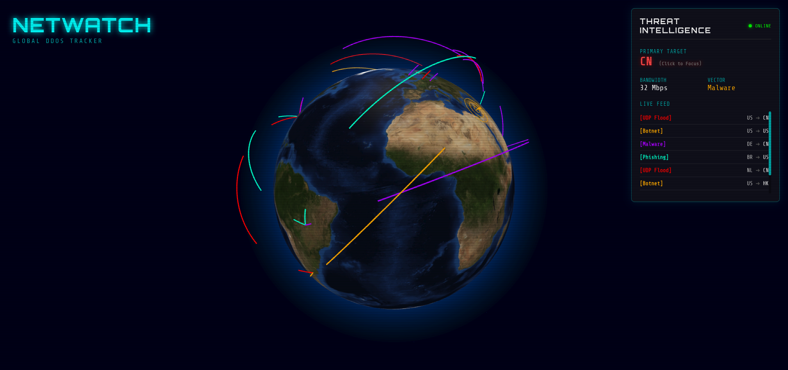

# 🌍 NetWatch: Global Live DDoS Tracker

> A real-time 3D visualization of global cyber threats using the MERN Stack, Socket.io, and Cloudflare Radar.

 

## 🚀 Overview

**NetWatch** is a cybersecurity dashboard that visualizes Layer 3 DDoS attacks as they happen around the world. It fetches aggregated threat intelligence from Cloudflare, processes geospatial data, and renders interactive attack vectors on a high-performance WebGL globe.

**Status:** 🟢 Live Monitoring | **Tech Stack:** MERN + Three.js

## ✨ Features

* **Cyberpunk UI:** Fully immersive "Hacker Terminal" aesthetic with scanlines and neon visuals.
* **Real-Time Data:** Streams live attack pairs (Origin → Target) using WebSockets.
* **Interactive 3D Globe:**
* **Attack Arcs:** Visualizes attack trajectories.
* **Impact Ripples:** Pulsing rings indicating victim countries.
* **Auto-Zoom:** Click a country in the dashboard to fly the camera to that location.
* **Live Analytics:** Glass-morphism dashboard calculating "Top Target," "Total Bandwidth," and "Attack Vectors."

## 🛠️ Tech Stack

* **Frontend:** React, Vite, Three.js (react-globe.gl), CSS Modules.
* **Backend:** Node.js, Express.
* **Real-Time:** Socket.io (WebSockets).
* **Data Source:** Cloudflare Radar API.
* **Security:** Server-side API Proxy (Env variables).

## ⚙️ Installation & Setup

### Prerequisites

* Node.js (v18 or higher)
* A Cloudflare API Token (Read permissions for Radar)

### 1. Clone the Repository

```bash
git clone https://github.com/thegoddo/netwatch.git
cd netwatch
```

### 2. Backend Setup

```Bash

cd server
npm install
```

Create a .env file in the server folder:
```Code snippet


CLOUDFLARE_TOKEN=your_actual_cloudflare_api_token_here
```

Start the Server:

```Bash

node index.js
# Output: SERVER RUNNING ON PORT 4000
```

### 3. Frontend Setup

Open a new terminal:

```Bash

cd client
npm install
npm run dev```

Open your browser at http://localhost:5173.
📂 Project Structure

netwatch/
├── server/
│   ├── index.js         # Main Entry point, API Polling, Socket.io
│   ├── countries.js     # ISO Code to GPS Coordinate Mapping
│   └── .env             # API Keys (Not committed to Git)
└── client/
    ├── src/
    │   ├── App.js       # Main React Logic & Globe Renderer
    │   ├── Dashboard.js # Glassmorphism UI & Analytics
    │   └── countries.js # Frontend Coordinate logic for Camera Zoom
    └── vite.config.js   # Build configuration
```

## 🐛 Troubleshooting

* Globe is Black? Ensure Hardware Acceleration is enabled in your browser.

* No Red Lines? Check the server terminal. If it says Broadcasting..., check your browser console (F12) for WebSocket connection errors.

* Cloudflare Error 400? Ensure your API Token has Radar: Read permissions.

## 🔮 Future Improvements

* Sound Effects: Add audio feedback for massive attack spikes.

* Historical Mode: Allow users to replay attacks from yesterday.

* Mobile Support: Optimize controls for touch screens.
